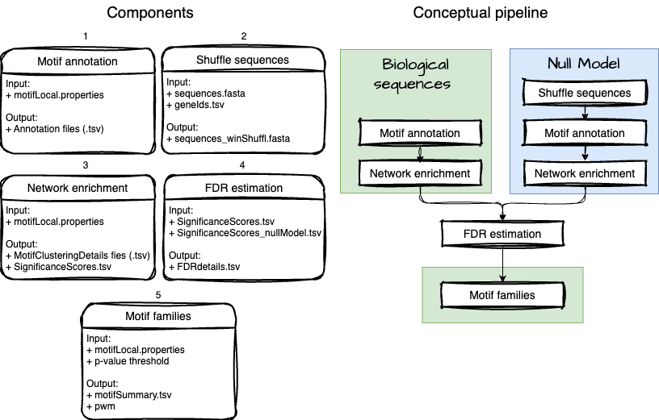

# LocalMotif

## Overview
#### Rationale
Protein localization is regulated through various mechanisms. Among these, sequence motifs in mRNA 3’ Untranslated Regions (3’ UTRs) are known to be involved in the transport of transcripts to their subcellular compartment, where protein translation will then often occur. However, most regulatory sequence elements remain uncharacterized. Proximity labelling coupled with tandem mass spectrometry has generated comprehensive protein co-localization networks that can address this knowledge gap. Indeed, proteins that are densely connected in such networks are likely to be in similar cell compartments. If such sets of proteins share a common mRNA sequence motif, this motif could be directly or indirectly related to their localization.

#### Description
LocalMotif is a tool for motif discovery in the context of protein co-localization networks (e.g. Human Cell Map, Go, Knight *et al.* Nature 2021). This algorithm measures the clustering of proteins with a shared 3'UTR sequence motif within the network. The significance of this clustering measure is then estimated from a normal distribution approximated from a Monte Carlo Sampling Distribution. To correct for multiple hypothesis testing, we assess the false discovery rate at various thresholds against a null model of randomized sequences.

LocalMotif is a series of Java applications that can be run from the command line. However, given the time complexity, a server with job parallelization is recommended. The final step of this pipeline is an R script provided as a Jupyter Notebook for easy user interfacing.

## Prerequisites
* Java Version 8+
* Required libraries : The Apache Commons Mathematics Library\
(`commons-math3-3.6.1.jar` included in project) and Apache Commons CLI (`commons-cli-1.9.0.jar` included in project)
<br><br>
* Jupiter notebook (optional)
* R

## Input files
#### 1. Sequences (.fasta)
3'UTR sequences corresponding to proteins in network. Additional sequences can be included but will be ignored.

#### 2. Protein Ids (.tsv) 
File mapping protein names (as found in the network file) to their RefSeq identifyers (as found in the .fasta file). If a protein has multiple identifiers, they can be listed on seperate lines. [BiomaRt](/https://bioconductor.org/packages/release/bioc/html/biomaRt.html) 
is a useful tool to generate this file.

|Protein Name | RefSeqIds |
|--- | --- |
|ABCB1   | NM_001348946
|ABCB1   | NM_001348944
|BDP1|   NM_018429

#### 3. Network
User provided .tsv file of a protein-protein interaction network. 

   Protein1 | Protein2 | Score
   --- | --- | ---
   ABC | ACC | 0.75

#### 4. Properties file 
E.g. `LocalMotif.properties` contained in repo.

This file is passed to the program as command line argument. It is important to update the working directory, file paths and the proper parameters. <br><br> The following properties must be included in the `.properties` file:

| Property Name           | Type      | Description |
|------------------------|----------|-------------|
| `project_name`         | `String` | Unique mame identifying your project
| `nullModel`       | `Boolean` | Specify if using randomized sequences (`true`) or biological sequences (`false`) Example: `true` |
| `working_directory`   | `String` | Directory which contains input files and where output files will be stored. Example: `/path/to/project/sequences/` |
| `annotation_directory` | `String`  | Directory where annotations files will be stored. It can be the same as the working_direcotry. Example: `/path/to/annotations/` |
| `fastaFile`   | `String` | Path to fasta file relative to working directory. Example: `input_files/sequences.fasta` |
| `geneIdsFile`   | `String` | Path to geneIdsFile relative to working directory. Example: `input_files/geneIds.tsv` |
| `networkRepositoryFile`   | `String` | Path to network file relative to working directory. Example: `input_files/network.tsv` |
| `corrThreshold`  | `Float` | Minimum correlation threshold to consider in network. Example: `0.5` |
| `clusteringMeasure` | `Integer` | clustering measure to use in analysis, TPD (`0`), TPPD (`1`), CoreTPD (`2`) . Example: `2` |
| `percentThreshold`  | `Float` | Percentage of annotated proteins to consider as the "core" proteins. Required for clustering measures TPPD and CoreTPD. Example: `0.4` |
| `removeOverlyConnectedProteins`  | `Boolean` | Remove overly connected proteins from network (`true`) or not (`false`). Example: `true` |
| `maxInteractions` | `Integer` | Number of interactions a single protein is allowed to participate. Required if `removeOverlyConnectedProteins=true`. Example: `400` |
| `lowerBoundToSample` | `Integer` | Smallest sample size to assess for Monte Carlo Sampling procedure. Recommended: `20` |
| `upperBoundToSample` | `Integer` | Largest sample size to assess for Monte Carlo Sampling procedure. Recommended: `2000` |
| `numberOfSamplings` | `Integer` | Number of times to sample network for Monte Carlo Sampling. Recommended: `1000000` |
    
# Pipeline


To execute this pipeline, you will need to perform the motif annotation (1) and network enrichment (3) steps on a set of biological sequences and shuffled sequences (i.e., null model). 

## Set up
Follow these steps to set up the LocalMotif project on your local machine or server:

#### 1. Clone the repository

```bash
git clone https://github.com/rnade046/LocalMotif.git
```
#### 2. Organize file structure
Create separate folders to manage analysis of biological sequences and shuffled sequences (null model). Move localMotif.properties file to proper working directory. For example:

```text
E.g. ~/Documents/project/
│
├── LocalMotif/                  # Repository (Cloned from GitHub)
│   ├── README.md
│   ├── commons-cli-1.9.0.jar
│   ├── commons-math3-3.6.1.jar
│   ├── families/
│   ├── localEnrich/
│   ├── annotateMotifs/
│   ├── fdr/
│   └── randomizeSeq/
│
├── sequences/                     # Biological Sequences Folder
│   ├── localMotif.properties       # Properties file copied from repo
│   ├── input_files/                 # Contains input sequence data
│   │   ├── sequences.fasta
│   │   ├── network.tsv
│   │   └── geneIDs.tsv
│
└── null_model/                             # Null Model Folder
    ├── localMotif_nullModel.properties     # Properties file copied from repo
    ├── input_files/                         # Contains input files
    │   ├── network.tsv
    │   └── geneIDs.tsv
```
#### 3. Compile instructions
All Java source code must be compiled before execution.
```bash 
cd path/to/directory/LocalMotif/
javac -cp ".:commons-cli-1.9.0.jar" annotateMotifs/*.java
javac randomizeSeq/*.java
javac -cp ".:commons-cli-1.9.0.jar:commons-math3-3.6.1.jar" $(find localEnrich -name "*.java")
javac -cp ".:commons-math3-3.6.1.jar" fdr/*.java
javac -cp ".:commons-cli-1.9.0.jar" $(find families -name "*.java")
```

#### 4. Execution instructions

```bash
# Program must be executed from LocalMotif/ repository
cd path/to/directory/LocalMotif/

# Further execution instructions are specified at each step. 
```

## 1. Motif annotation
Identifies motifs from the input sequences (.fasta) and generates an annotation file (.tsv) that maps the proteins associated to each motif. Motif annotation occurs in 2 steps: (1) Motif enumeration, and (2) Generating the annotation files. 

#### Command line arguments
* `-p`   `--properties`  Properties file (e.g. `localMotif.properties`), supplied in the repository. Important: files paths and parameters should be updated.
* `-s`  `--step`  current program step to execute (options: 1 or 2)
* `-n` `--file_number` referencing the motif file, range [0-999], required for step 2 (`-s 2`)
* `-h` `--help`

#### Output
* Annotation files, results are divided into 1000 files, numbered [0-999] (e.g. `annotation_0.tsv`) 

#### Implementation
Note : given the size of motifs to test and time complexity of this algorithm, it is recommended to execute this part of the program on a server with job parallelization capabilities.

```bash session
# step 1 = lists motifs
java -cp ".:commons-cli-1.9.0.jar:annotateMotifs" MapMotifsToProteins -p path/to/localMotif.properties -s 1
```
```bash
# step 2 = generate annotation file
# can be optimized with job parallelization
for file in {0..999};
do
   java -Xmx4g -cp ".:commons-cli-1.9.0.jar:annotateMotifs" MapMotifsToProteins -p path/to/localMotif.properties -s 2 -n $file
done
```
## 2. Shuffle sequences
Shuffles sequences within non-overlapping windows. Randomized sequences are used to control for false discoveries.

#### Input files
1. Sequences (e.g. `sequences.fasta`): user-provided 3'UTR sequences (.fasta) corresponding to proteins in network
2. GeneIds (e.g. `geneIds.tsv`): user-provided (.tsv) mapping protein names (as found in the network file)

#### Execution
```bash
java java -cp "randomizeSeq" RandomSeqMain /path/to/sequences.fasta /path/to/geneIds.tsv
```

#### Output
* Randomized sequences in a Fasta file (e.g.`sequences_winShuffled.fasta`) - created in the directory containing `sequence.fasta`

## 3. Network enrichment
Assesses the local enrichment of proteins associated with the same sequence motif in the correlation network. For each motif, the clustering of it's associated proteins is measured and the significance is estimated. Network enrichment occurs in steps: (0) network initilization, (1) cross referencing annotations with the network information, (2) assessing protein annotation frequencies, (3) performing Monte Carlo Sampling, (4) approximating the normal distribution, (5) assessing motif clustering and significance, and (6) combine signficance scores for FDR estimation.

#### Command line arguments
* `-p`   `--properties`  Properties file (e.g. `localMotif.properties`), supplied in repo and should be updated with relevant files paths and parameters.
* `-s`  `--step`  current program step to execute (options: 1 or 2)
* `-a` `--annotation` annotation file number, required for step 2 (e.g. `-s 2`)
* `-d` `--distibution` distribution sample size, required for step 3 (`-s 3`)
* `-h` `--help`

#### Output
* (e.g.`motifClusteringDetails_0.tsv`), results are divided into 1000 files, numbered [0-999] in the same order as the annotation files

#### Execution
Note : given the size of motifs to test and time complexity of this algorithm, it is recommended to execute this part of the program on a server with job parallelization capabilities.

```bash
# step 0 - initialize network 
java -cp ".:commons-cli-1.9.0.jar:commons-math3-3.6.1.jar:localEnrich" Main -p path/to/localMotif.properties
```
```bash
# step 1 - create accessory files (note: can be optimized with job parallelization)
for file in {0..999};
do
java -cp ".:commons-cli-1.9.0.jar:commons-math3-3.6.1.jar:localEnrich" Main -p path/to/localMotif.properties -s 1 -a $file
done
```
```bash
# step 2 - combine protein frequencies
java -cp ".:commons-cli-1.9.0.jar:commons-math3-3.6.1.jar:localEnrich" Main -p path/to/localMotif.properties -s 2
```
```bash
# step 3 - perform Monte Carlo Sampling (note: can be optimized with job parallelization)
for sampleSize in {20..2000}
do
java -Xmx4g -cp ".:commons-cli-1.9.0.jar:commons-math3-3.6.1.jar:localEnrich" Main -p path/to/localMotif.properties -s 3 -d $sampleSize
done
```
```bash
# step 4 - compute normal distribution parameters
java -cp ".:commons-cli-1.9.0.jar:commons-math3-3.6.1.jar:localEnrich" Main -p path/to/localMotif.properties -s 4
```
```bash
# step 5 - assess motif clustering and significance (note: can be optimized with job parallelization)
for file in {0..999};
do
java -Xmx4g -cp ".:commons-cli-1.9.0.jar:commons-math3-3.6.1.jar:localEnrich" Main -p path/to/localMotif.properties -s 5 -a $file
done
```
```bash
# step 6 - combine signficance scores for FDR estimation
java -cp ".:commons-cli-1.9.0.jar:commons-math3-3.6.1.jar:localEnrich" Main -p path/to/localMotif.properties -s 6
```

## 4. FDR estimation 
The algorithm false discovery rate is estimate by comparing the clustering performance of motifs identified in biological sequences to the clustering performance of motifs identified in randomized sequences (nullModel). FDR estimation occurs in a single step. 

#### Commandline arguments 
1. Working directory (`/path/to/working/directory/`) containing the following files;
2. List of significance scores calculated during network enrichment performed on biological sequence (e.g. `significanceScores.tsv`)
3. List of significance scores calculated during network enrichment performed on randomized sequences (e.g. `nullModel_significanceScores.tsv`)

#### Execution
```bash
java -cp ".:commons-math3-3.6.1.jar:fdr" MainFDR working/directory/path/ significanceScores.tsv nullModel_significanceScores.tsv
```
#### Output
* Table file indicating the FDR estimated at given *p*-value thresholds and number of motifs significantly clustered at this threshold  (e.g.`FDRatThresholds_monotonicTransformation.tsv`). Note: this file should be moved to the default working-directory for this project for the next steps.

## 5. Motif families
Groups significantly clustered motifs into families. Occurs in four steps: (1) Extracts the significantly clustered motifs at *p*-value threshold, and clusters them based on annotation similarity. (2) Performs hierarchical clustering. (3) Identifies the representative motif for family, and (4) obtains the position weighted matrix for the family.

Important : if the network enrichment analysis was performed using the coreTPD or TPPD, the similarity between motifs will be calculated for both the subset of core proteins, and all proteins annotated by the motif. Steps 2-3 should be performed seperately on both sets of data and can be controlled through the `-m` flag. 

#### Command line arguments
* `-p`   `--properties`  Properties file (e.g. `localMotif.properties`), supplied in repo and should be updated with relevant files paths and parameters.
* `-s`  `--step`  current program step to execute (options: 1,2,3)
* `-t` `--threshold` p-value threshold, range [0.0-1.0]
* `-m` `--mode` similarity is computed for all proteins or core proteins, required for step 2 and 3, options: 'all' or 'core'
* `-c` `--cutree` cutree height, required for step 3, value >0.0
* `-n` `--motifNumber`
* `-h` `--help` number corresponding to motif family to evaluate, required for step 3

#### Execution
```bash
# step 1 - Cluster similar significant motifs at given p-value threshold (e.g. 0.05)
java -cp ".:commons-cli-1.9.0.jar:families" ClusteredMotifsMain -p path/to/localMotif.properties -t 0.05 -s 1
```
```bash
# Intermediate step - perform hierarchical clustering
# User needs to modify file paths that are delimited by comment blocks, eg:

########################################################
# specify working directory file path and file names
working_directory <- "/path/to/project/motifFamilies/all/"
matrixFile <- "DistanceMatrix.tsv"
motifsFile <- "MotifsInMatrix.tsv"
########################################################

# Option 1 - Jupyter notebook 
jupyter notebook families/ClusterMotifs.ipynb

# Option 2 - provided R script
# Open `ClusterMotifs.R` in R/R Studio
```
```bash
# step 2 - Select representative motif for each family and summarize significant motifs

# e.g. threshold = 0.05, mode = all, cutree = 0.75
java -cp ".:commons-cli-1.9.0.jar:families" ClusteredMotifsMain -p path/to/localMotif.properties -t 0.05 -s 2 -m all -c 0.75 -f path/to/FDRdetails.tsv

# e.g. threshold = 0.05, mode = core, cutree = 1
java -cp ".:commons-cli-1.9.0.jar:families" ClusteredMotifsMain -p path/to/localMotif.properties -t 0.05 -s 2 -m core -c 1 -f path/to/FDRdetails.tsv
```
```bash
# step 3 - Evaluate motif families for sequence logo (note: can be optimized with job parallelization)

# e.g. threshold = 0.05, mode = all, cutree = 0.75, where there are 10 motif families (numbered 1-10)
for i in {1..10};
do
java -cp ".:commons-cli-1.9.0.jar:families" ClusteredMotifsMain -p path/to/localMotif.properties -t 0.05 -s 3 -m all -c 0.75 -n $i
done
```
#### Output
* `MotifSummary.tsv`  file detailing signficantly clustered motifs, their motif family, false discovery rate, etc.
* pwm - for each motif family, a position weighted matrix and a list of motif instances is generated for sequence logo generation